# Iterative Prototype 5 - 02.04.26

(sorry for the late submission!)

This week, a bit of everything needed to happen.

First of all: finishing polishing the first mini game. See Jolene’s journal.

Second: fixing the hiding mechanism. That’s me!

## HIDING MECHANISM
The way it was set up previously prevented the player from “hiding” until the “door opening” sound started and next it would automatically stop the hiding when the “door closing” sound ended.

We thought about it and ended up deciding that it was more interesting if the player was able to press “H” and hide whenever they wanted.

In the code, I honestly was getting lost in all the different variables I had created to keep track of the walking sounds and the door opening mechanism etc.

I am pretty sure there is a simpler way to do what I did but I couldn't figure it out


Now it was time to finish polishing the BreakOut Game.

## BREAKOUT GAME

Because of a lack of time, we decided to not add a special winning mechanism and simply make it so once every brick is destroyed, the game is won. The challenge once again lies more in not getting caught by the security guard rather than on completing a complicated mini game.

I was working on Breakout in a different project file so I had to download the asset packages and upload them in our game. I did so and everything seemed fine. But then I don’t know what happened and half of the scripts disappeared.
For a few hours I tried to recover the scripts I had lost. Couldn't figure it out, ended up having to recreate all of them. The joys of Unity.

So far this semester I had been pretty lucky and didn’t experience any big technical issues that led me to lose files and lose a lot of time, but it finally happened! 
Once I thought I had it solved. I pushed it to Jolene. We then later realized that our game over screen disappeared? I also don’t know how it happened, and I had to redo it.

After I finished redoing the GameOver screen, a new problem emerged….I was unable to hear any of the sounds! It drove me crazy for 2 hours. 

**So, what did we learn?** 
Always pay attention to what you’re deleting/duplicating. And be careful with how you name anything, to not end up deleting anything by accident :) Lesson learned.

## Next up:
It seems like we got overwhelmed with the amount of work in our other classes, which made us rethink what we had to deliver for next week.

Our deliverable was: having a solid hiding mechanism with sound, and 3 playable mini games

It seems like our goal is going to present 2 mini games for playtesting, and if we have the time, adding the third one for the following week.


# Iterative Prototype 4 - 26.03.26

## Playtest feedback from last week:

Last week, we showed our prototype to a few people and the main feedback we got was regarding the sound design. At of now, the sound is confusing because it sounds like the security guard is very close to the player, already in the room. This makes the player want to hide (press H) all the time, when we, the designers, would like the player to understand that the danger is only present when they hear the "door opening" sound.

So we know, as designers, that a big thing to focus on is our sound design, because it is the core of our gameplay.

## To do for following week
Me and Jolene came with this list of things to do:

**THINGS TO DO:**

Both:

we NEED
- storm sound
- correct/wrong sounds


Josephine:
- you can press H whenever you want
- its not game over if you stop pressing when door is closing
- work on spatial aspect
- implement storm 
- fix game over screen (thunder + police sirens)
- implement wrong/right sound in mini game1


Jolene:
Finish polishing game 1:
- replayability
- add environment
- maybe sound for moving the computer

## My Progress

I started with fixing the game over screen.
I wanted the footsteps sound, as well as the hiding mechanism to not be possible on that scene. But in my SecurityOffcier script in the mini game 1 scene, I put DontDestroyOnLoad because I want those sounds and mechanics to be in every mini game.
Therefore, in my gameover scene script, I need to put:

```csharp

SecurityOfficer officer = FindFirstObjectByType<SecurityOfficer>();
if (officer != null) Destroy(officer.gameObject);

```

I also added police sirens sounds, and chose a new thunder sound that had a lot more thunderstruck.

In the Mini Game1 itself, I implemented the "correct" and "wrong" sounds and added the background storm sound. It still feels a little messy I'm having trouble with the mixing of all the sounds, the different volumes etc. Will need work.

Then, I was supposed to work on fixing the hiding mechanism.
And I didn't!
Very busy week, and exam on 2011-2014 Egypt Thursday morning, I'll spare the details.

Jolene was also caught up in other things, we're gonna have to make up for it this following week!

It seems like realistically:
- our core mechanism is here, it needs polishing, but it works, which is good news
- 2nd mini game shouldn't take too much time to implement, since we're using of of my breakout iterations. (I'm fully jinxing it right now)
- the third mini game has to be created from scratch, but we will keep it simple/

So it's not all bad, we're going to have something nice in the end.


# Iterative Prototype 3 - 19.03.26
Last week during class Jolene and I identified our priorities for the next few weeks.

It seems like the most important thing is that our hiding mechanism works, our audio environment adds the tension we want it to add and has at least 2 mini games working.

We made this list of things that need to be done:

Priorities:
- Finding and implementing sounds
- hiding mechanism
- add a number of the code 
- sub-priority:
- Draw the front of the monitor

Finding sounds:
- storm
- footsteps
- door opening
- keys shaking
- door closing


How will the hiding mechanism be implemented?

Sound is getting louder 

Press H -> fade to black

Stop pressing -> back to what you were doing

if door opens and you’re not pressing H
-> game over? or restart level 

Our task distribution for this week looked like:

Jo:
- polish breakout variant
- find the sounds
- hiding mechanism

Jolene:
- Draw the front of the monitor
- Add an arrow to go to back (to switch scenes)
- error message ex “you cannot use the computer it’s still broken!”
- refine the first game


Our **design value**: Explore the way audio can impact a player’s experience

This week, the goal was really to test out the feel of the audio cues. How does it impact the player’s experience? How does it impact the completion of the mini game? How does it impact the flow of the game? Does it bring out the right amount of tension?
Therefore, it was a a role and implementation prototype


## WORK DONE

Honestly, finding good sound effects was pretty hard, I’m not convinced by the ones I found but I had to keep moving.

My job was to work on implementing the hiding mechanism.

The prof’s suggestion of having the camera panning down to hide the user’s view or if you don’t press H the camera slowly goes back up was good, but since we’re still not sure of how our camera work is going to look like, I decided to keep it simple with the black out screen.

I started with putting on paper everything I was going to need to implement to get an idea of the task ahead and how to start it

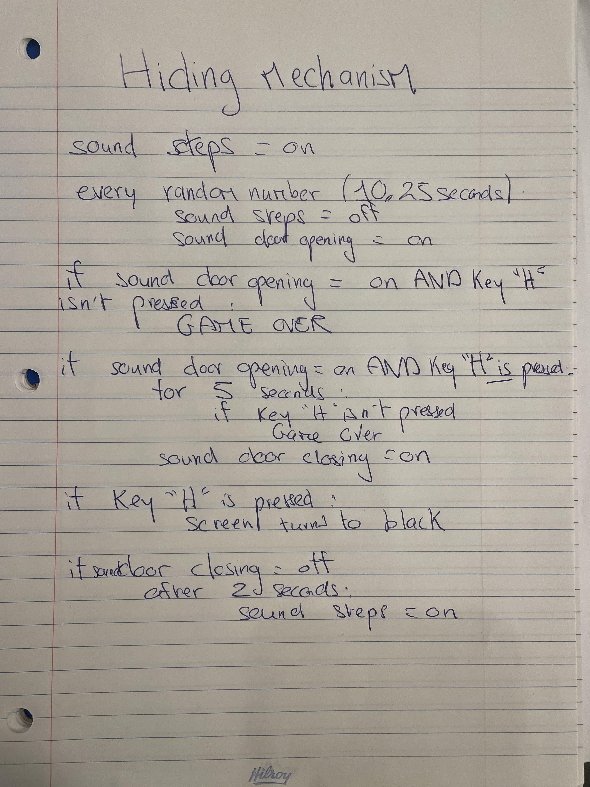

The implementation of the Hiding mechanism entailed a lot of bool variables keeping track of whether or not the door was open, the “H” key was pressed etc and a lot of “if” loops.

Things I learned while implementing:
- understanding the difference between **Awake()** and Start(), especially here because since I want the mechanism to exist during every mini game, I need to put the DontDestroyOnLoad in Awake()
- using **Time.deltaTime** in Update() which is the completion of seconds since the last frame inside your code while you’re doing something. This allows to make sure that no matter what computer the project is opened on, the game runs at the same rate.

I subtracted Time.deltaTime from a lot of my variables in Update(): the timer that tracks the door opening, the timer that tracks the steps etc

This way we have a pretty good idea of what the hiding mechanism feels like:

[Hiding Mechanism Video](Media/IterativeProto3/soundexample.mp4)

The fidelity of the sounds is high because they are real files I downloaded from pixabay. But the game itself is pretty low fidelity and needs a lot of polishing


I think overall it makes the player feel the tension and adds some fun! Needs polishing, but the core is here


Things that need iteration/improvement:
- right now, it’s GAME OVER if the player doesn’t press H in time or doesn’t hold it long enough, it feels too punitive. Should there be a 3lives system? Should you have to restart from the start?
- you can only press H and “hide” after the door has started opening, maybe you should be able to do it before to get familiarized with how it works?
- Same thing, once the door closes the H is released automatically, maybe better if you can just keep pressing a little longer?
- Need to fix that once game over screen is on, the walking sound effects stop
- Need to improve the spatialization of the sounds


To see what Jolene worked on, see her journal ([link](https://github.com/jbodika/CART-315/blob/main/Process/Journal.md#iterative-prototype-ii-022626---021226))

## Next Steps

This week I didn’t have the time to work on the BreakOut changes, so that’s priority for next week.
We also need to find the final sounds: storm, correct and wrong


# Iterative Prototype 2 - 12.03.26

During last class, me and Jolene decided to work on the project together.

We liked the idea of a puzzle game, keeping something along the line of my idea (see Iterative Proto1).
 
**Things we want to have:**

- a storyline: even if simple (parent catches you etc)
- Use of audio cues
- Pixel Art
- Add dialog/Thought bubbles
- We like the idea of someone catching you/some urgency

We brainstormed ideas for environments the puzzles could be in:

- school desk
- Computer desktop/phone screen
- architect desk (you play with maps)
- doctor operation table  
- robbing a bank
- cooking/kitchen (fridge)
- wardrobe
- computer wiring
- suitcase 

We made a **shortlist** of 3 environments that seemed like they had the most potential for diversity in mini games:

- School Desk
- Computer Desktop
- Wardrobe

For the following week, we decided to separately brainstorm mini-games ideas for all 3 environments and decide and which ones inspired us most/


## MEETING MARCH 5TH

**My brainstorm for meeting 1:**

School Desk:

- rearranging the desk (like in my iterative prototype 1)
- Sorting items in a pencil case by color
- sorting pencils by size
- drawing in a notebook

Computer Desktop/phone:

- playing pong on computer and when you win you get a code
- sorting your desktop
- something to do with the photos app? You have to find something
→ anything email/text/photo related will require a lot of writing/photo

Wardrobe:

- sorting shirts by color
- pairing socks together
- sorting shoes by size
- finding the “odd” object and removing it (finding the hawaiian shirt in middle of regular dress shirts)
→ scared it is going to be too much art/drawing to do


**Jolene’s Brainstorm:**

School Desk:

- It's detention you want to get out.
- Rewrite the words on the paper
- Fix the time based off this riddle
- you see a clock and you’re trying to set it up to fix the time
- write graffiti on the desk 
 
Computer Desk/Phone:

- Build a computer ? (all components are layed out you have to put the in the right place)
- once its built set up the monitor there's different wires you have to connect to set it up
- turn it on, a mini game that looks like the terminal (not sure what’d it look like) pong game 

Wardrobe:

- It’s late at night and you’re trying to sneak out of your parent’s home to go to a party.
- Fix the lightbulb – what if we show the action before it happens so we see a light bulb fall, then in the corner at the bottom there’s a box of lightbulbs, so the player has to screw it back on. there’s a dead lightbulb you have.
- Pick an outfit
- Grab your shoes

We decided to go for the **Computer Desktop environment**

We thought it was the one that appealed to us the most.

For the following week we distributed the tasks like this:

**Jo:**
- write a more detailed game pitch 
- Find sounds (error, correct, footsteps, storm)
- Start working on the icons (red cross, green check)


**Jolene:**
- Sketches
- Create the monitor and the wires 
- Program the drag and drop functionality, Correct/Err functionality. 


Jolene: Implementation
Josephine: Role
Both: Look and feel.


For the sounds: 
I found a storm ambiance sound but was not convinced by the footsteps sounds I found. We might have to 


Here is our game pitch:


## SHORT GAME DESIGN DOC

**Game Pitch:**

You are working an office job. While your boss was on vacation, you heard that a round of layoffs was going to happen and decided to find out who was going to be fired. To do so, you sneaked in their office and snooped around on the computer. You were not careful and spilled coffee all over it, making it unusable. Your boss is coming back to work at 7am tomorrow. You now have to sneak into the office at night and fix the computer in order to have a shot at accessing the file. By solving puzzles, you can find the code to the confidential folder and let your friends know their fate. 

**Main Mechanics:**

- Multiple mini-games (puzzle inspired) to fix the computer, and then to get the code to access the confidential folder.
- paying attention to audio cues (security guard walking around, opening door) and pressing a button to hide under the table when security walks in

**Gameplay loops:**

- Macro: fix the computer and solve all the puzzles to get the access code to the file and let your friends know they are on the layoff list.

- Mid: solve a puzzle while paying attention to the audio cues in order to not get caught by the security guard

- Micro: solve puzzle with click or drag and drop mechanics


**Gameover condition:** security walks in and you were not fast enough to hide.

**Precedents:**

Stress about getting caught feeling: Hello Neighbor

Some of the casual puzzle games: A little to the left

Environment feel:

office space, The Stanley Parable inspiration

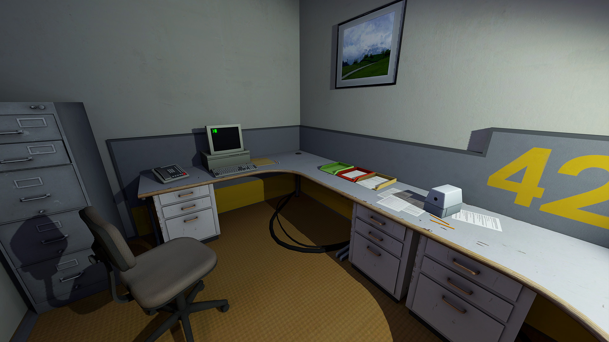

It’s night, with storm outside

**Sound ambiance:**

The audio is what creates this feeling of anxiety.
You hear the storm outside. You hear the footsteps of the security guard patrolling in the office.
When you hide from the security guard, you hear the sound of the door opening.


## Different mini games:

**First mini game: Fixing the computer wires**

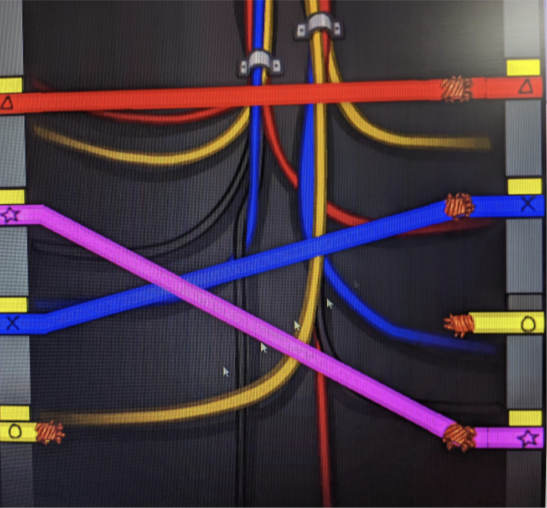

Inspiration: Among Us wire task

Jolene’s sketches:

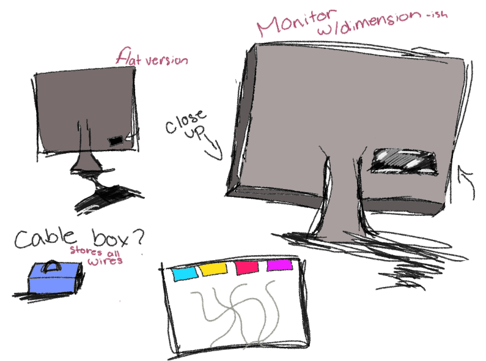
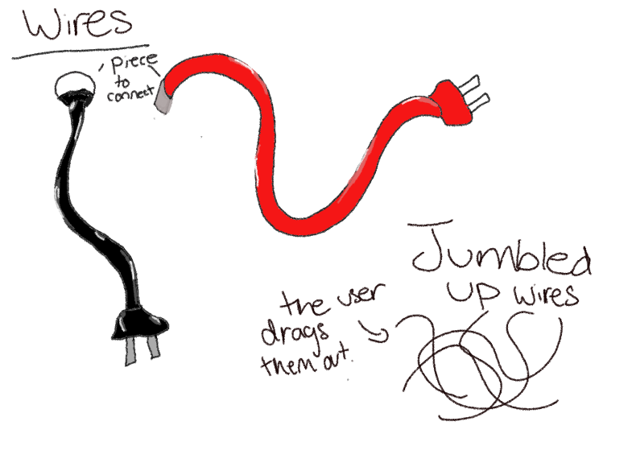

There are 4 wires and you try to connect them to the right end. 
If you get it wrong, a RED CROSS appears on your screen with an “error” sound, you try again. 
When you get it right, a GREEN CHECK appears + “correct” sound.


Green Check				


Error Sign 
(Made by Josephine)

This is the mini game Jolene worked on implementing this week. 
This is what it looks like right now:

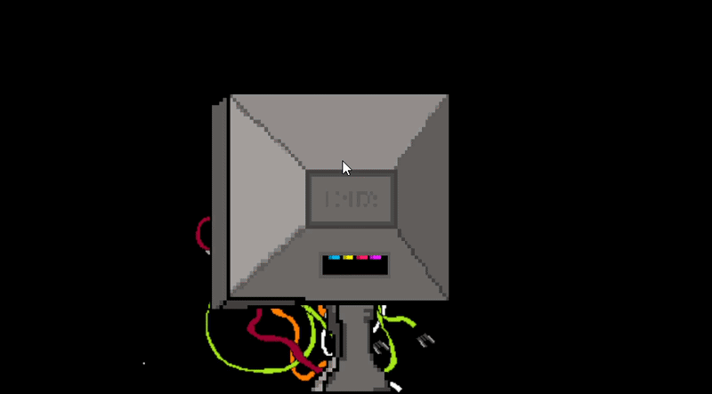
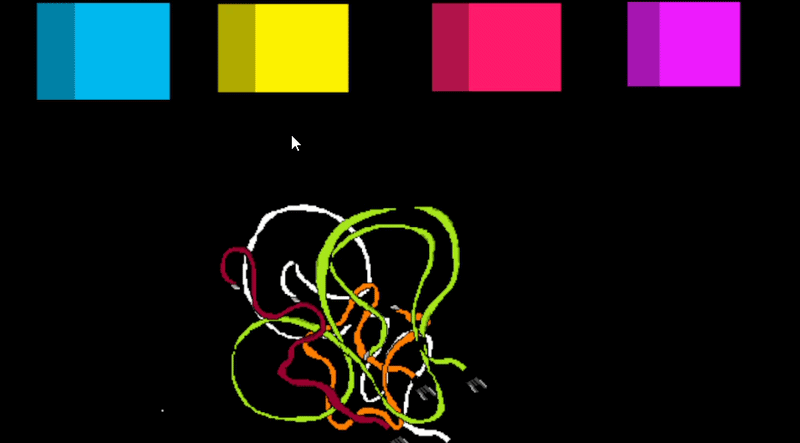

For more details on her process, see her journal: [link](https://github.com/jbodika/CART-315/blob/main/Process/Journal.md#implementation)

**Mini game 2: Breakout variation**

Once the computer is fixed, you can finally enter the computer.
To get the 1st digit of a 3 digit code, you have to beat a game 

Idea:
Using and improving Josephine’s Exploration Prototype 4: 
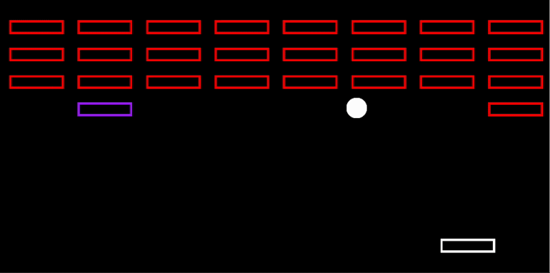

New rules and winning conditions will be added.

**Mini game 3, cleaning up desktop:** 

Now you’re in, you can access the computer desktop.

Inspiration: Pippin Barr’s *It is as if you were doing work* ([link](https://pippinbarr.com/itisasifyouweredoingwork/info/))

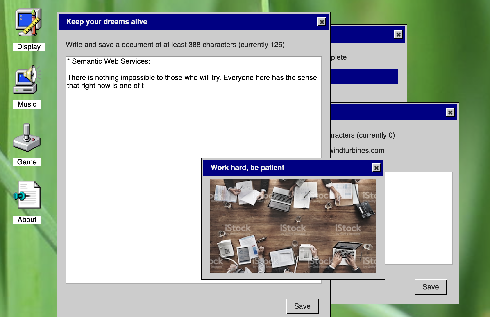

The desktop is a mess, you can’t access anything, you have to sort out files in the right folders.
Once the desktop is clean, you get the 2nd digit.

**Mini game 4, anti virus:** 

Once you’ve finished cleaning the desktop, an ALERT sign appears, letting you know a virus is infecting the computer.

To fight it back, you need to solve a puzzle.

Inspo, mini metro game:

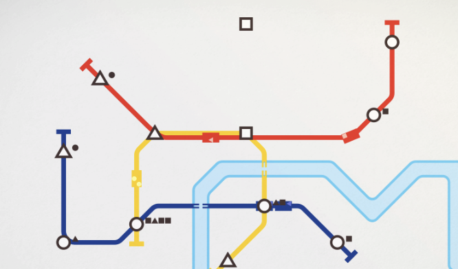

Once the puzzle is solved, you get the final digit.


**Acquiring the layoff file**

Once you have the code, you can click on the confidential folder, put in the code, and click on the file.

You then get an epilogue, with some text explaining how you managed to leave the office, email the file to your colleagues and have them all feel very grateful and organize a riot in the office the following day in protest of the layoffs. The End.


**Hiding under the desk mechanic:**

You hear the security guard’s footsteps. When you hear him really close, it’s time to hide under the desk.
To do so, you have to press the key “H”.

The screen will turn to black and you will hear the sound of the door opening. Keep pressing the key until you hear the door close.

If you fail at pressing H before the door opens or you stop pressing it while the door is open, it is game over.


## NEXT STEPS:

Now in class we will test out Jolene’s prototype more, make a list of the things to improve and our to do list for the following week.

It seems likely that I will start working on polishing the Breakout variant, and we’ll start working on implementing the sounds.


# Iterative Prototype 1 - 26.02.26

## **Ideation Workshop Prototype:**

## *Idea 1:*

Our two words were **“snowmobile”** and **“angry dog barking”**.

You live in Lapland, Finland and own sled dogs. Your mean neighbour challenges you to a race, snowmobile vs dog sled. You accept but end up losing pretty badly. You make it your mission to train your dogs for the revenge race that is happening a week later.

A 2D pixel art racing and strategy game where you have to win races against other dog sledders in order to win money that will allow you to buy resources (water, meat, supplements) that need to be smartly distributed to your dogs in order to improve their statistics. You are in control of the placement of your dogs, and your dogs' stats as well as your skills during the races will determine their outcome. All this training comes to fruition when you race the final boss, the snowmobile, and try to get revenge.

**Main Mechanics:**

- racing on ice tracks, different levels with different difficulty and obstacles
- resource management: which resources to buy, how to use them best to make your dogs more powerful
- strategy: all your dogs have different stats. How do you place your dogs in formation in front of the sled: which dog has to be placed in front? Which one should be at the back etc

**Gameplay loops:**

- Macro loop: winning the race against the snowmobile
- Mid loop: racing against other sleds to get better/win money
- Micro loop: buy resources and distribute them to your dogs

Design values: nature vs machine, relationship with your sled dogs

Precedents:
Racing: Mario kart

aesthetics wise, look wise: Celeste

## *Idea 2:*
The words were **“suburban house”, and “omnipresence”**.

Here you are, being forced to do your homework at your desk again, and you know your dad is going to walk up the stairs and check on you soon. But you would rather do anything other than homework, like for example rearranging your desk.

A puzzle game where you have an example layout of how you are supposed to move the items on your desk around. You have a short amount of time to do that rearrangement, and you hear your dad’s footsteps getting closer and closer as he walks up the stairs. Finish the puzzle in time, pull your laptop out to fool dad, and repeat.

**Main mechanics:**

- moving around the items on your desk to match the layout shown.
- taking your laptop out of your bag as soon as you’re done to fool dad

**Gameplay loops:**

- Macro loop: completing a few puzzles without getting caught by your dad.
- Mid loop: match the desk to the example layout
- Micro loop: drag and drop, rotate objects etc

Design values: performance in stress-induced situations

Precedents:
Puzzle aspect: A little to the left

Stress feel when hearing the footsteps: Hello Neighbor


## *Idea 3:*
Our words were **“suburban house”** and **“meat”**. 

You move into a new house in the suburbs and find out that the previous tenants owned a restaurant and left entire fridges filled with meat in the basement. You decide to open a carnivore restaurant in your house where you only serve meat based meals. 

A cosy cooking game that alternates between cooking sections and social moments where you need to talk to your neighbors to ask them to teach you meat based recipes to add to your menu.

**Main Mechanics:**

- dialogue with customers to take order and build relation
- cooking at the cooking station
- dialogue with neighbors to acquire new recipes

**Gameplay loops:**

- Macro loop: unlock all the meat-based recipes in order to cook all the meat you have and empty your fridges
- Mid loop: take orders, cook them, visit your neighbors to acquire recipes
- Micro loop: choose the right ingredients, cut/chop/cook

Design values: relationship building with your community

Precedents:
esthetics and cooking gameplay: Good Pizza Great Pizza

## Decision on idea to pursue
I like these three ideas, but when thinking about constraints: 
- time to complete the project (7 weeks)
- time that can be allocated to the project every week 
-  my limited artistic skills
 
I feel like **Idea 2**: the puzzle game is the one that I should go with.
It has one strong mechanic that can be iterated and hopefully reach a satisfying feel, and a lot can be experimented with when it comes to the sound design to add stress elements, urgency etc.

## First Prototype
So to get started, I want to test if the act of rearranging items on a desk with the pressure of time feels fun and engaging at all. I didn’t feel like I needed it to be in a game engine to test the core of it, so I decided to do it on Google Slides.

I also wanted to find a footsteps audio that I could play while someone plays to test the “stress” aspect that would be added but I couldn’t find an audio I liked enough.

I used 7 pictures of items that would be on a desk and placed them around

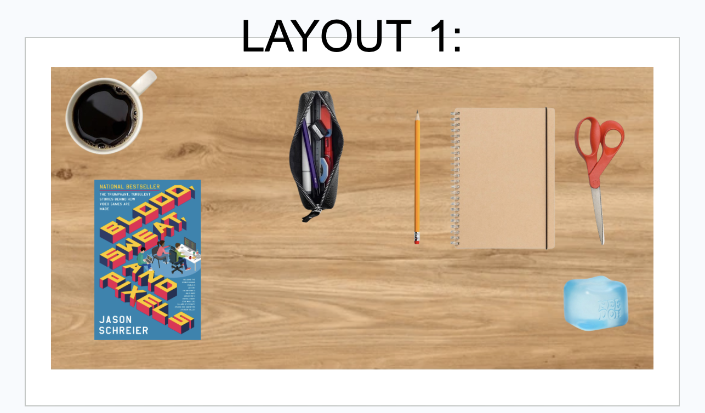

With the next slide ready to be played with: 

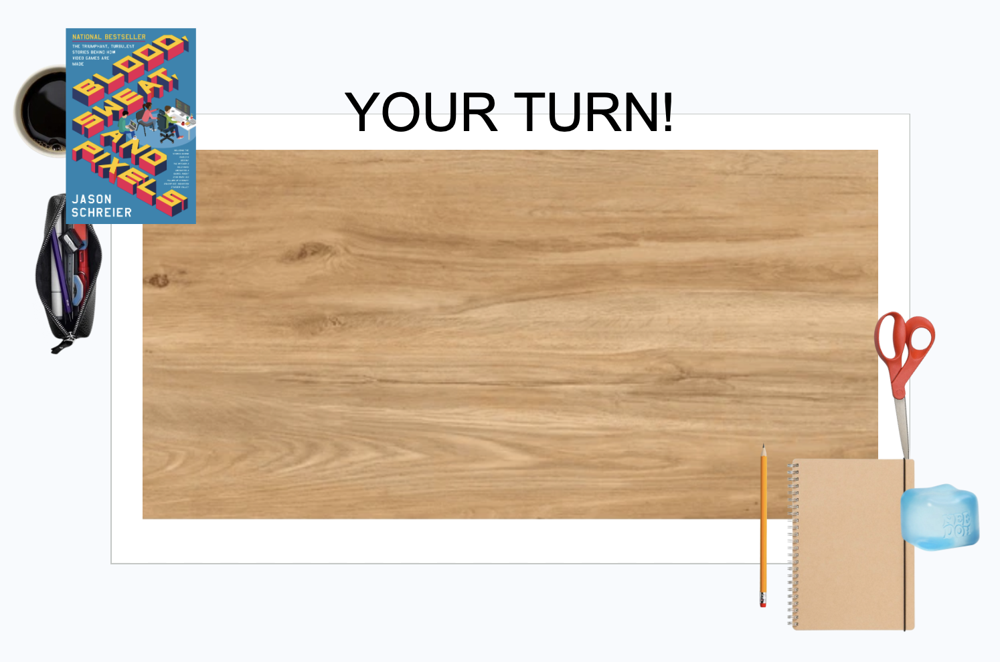

I made 3 “levels”, for the 2nd layout you have to rotate objects around:

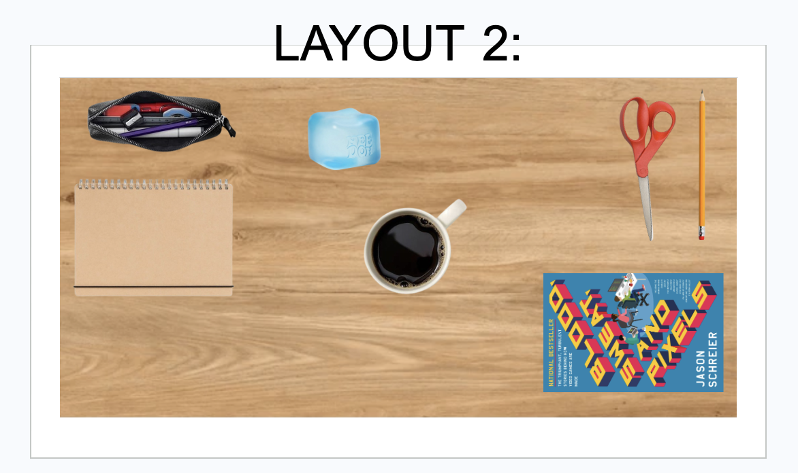

And I tried to make the 3rd level even harder:

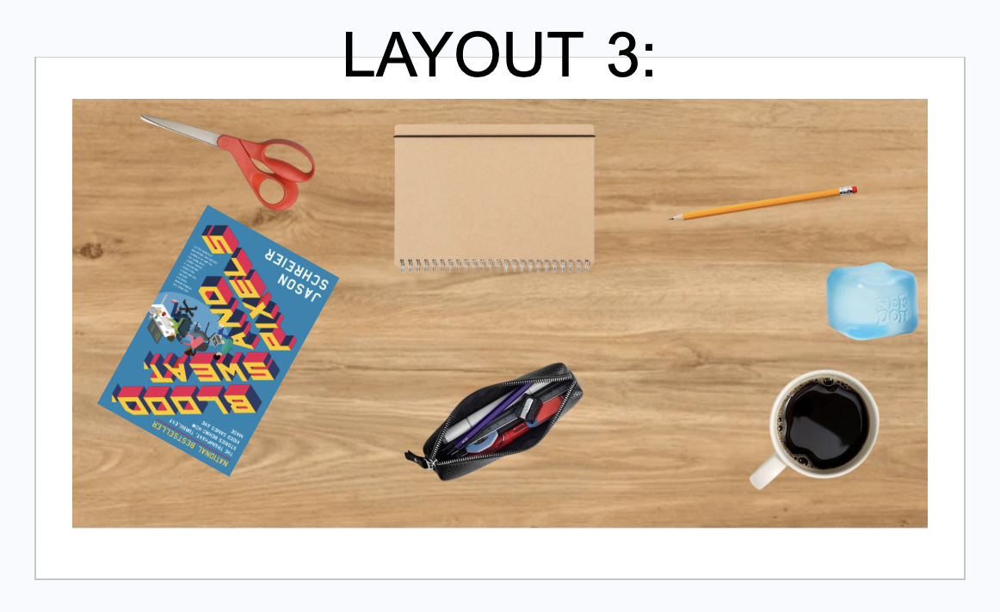

For layout 1 and 2 I put 60 seconds to complete it and 40 seconds for the 3rd layout. 


Things that need playtesting and iteration:
- amount of items on desk
- amount of time you have to rearrange the items

Interested to test in class and get feedback!


# Exploration Prototype 4 - 19.02.26

My prototype last week added on top of the breakout we made in class. I made it so one block is randomly another color, and once this special block is destroyed, it gives the player a lot of points and multiple new balls appear and allow the player to break the rest of the blocks a lot faster.

Adding new balls gave a sense of messiness that I was not too sure about, so for this week I decided to use what we learned in class with the shmup and make it so that once the special block is destroyed, the paddle starts to be able to shoot bullets, changing the main mechanic of the game while the player is playing.

Therefore, I took a look at the schmup and took inspiration from it.

I had to create a new script for the paddle that would get triggered once the ball destroyed the special block and make the paddle able to shoot bullets. 

I used the same script than the shooting script for the schmup but added a boolean set to false

```csharp
public bool Shoot = false;
```

To activate this script, the boolean needs to be set to true when the special block is destroyed. That means the change need to happen in the BreakoutBall script which is attached to the ball, while the shooting script is linked to another game object, the paddle. The script needs to modify the script that is linked to another gameobject. I looked it up and found out about the function ```FindFirstObjectByType```. So I added to my BreakoutBall script, under the loop if special block:, 

```csharp
ShootingPaddle paddleShoot = FindFirstObjectByType<ShootingPaddle>();
paddleShoot.Shoot = true;
Destroy(gameObject);
```

So that the boolean in the ShootingPaddle script is set to true and the ball gets destroyed so it doesn’t get in the way of the bullets that are going to be shot.

In the ShootingPaddle script that is now activated, the paddle is shooting a bullet prefab that destroys bricks, doesn’t bounce, and destroys itself when it hits a wall.

After a few tries and modifications, the game runs.


In terms of design itself, I think it is a nice touch that the gameplay changes when playing, moving from breakout to more of a shooting mechanic. Next step would be to have the bricks start moving once it gets in shooter mode, to enhance the feeling of targets.

Looking in the future, when it comes to the implementation itself: I wonder if it could be fun to not warn the player that the mechanism changes while playing. How do we go about adding an element of surprise without “betraying” the player’s trust? Things to think about...


# Exploration Prototype 3 - 12.02.26

For this week’s exploration prototype, I wanted, just like last week, to build on top of the prototype we saw in class. 
This week, it was Breakout. I wanted to test what it would feel like if one of the bricks was not red but another color, and if that brick was special in the fact that once it gets destroyed, it gives +5 points to the player and spawns a few more balls on the level. 

First, I had to make it so that one of the bricks had to randomly be a different color. In order to do so, I made changes in the BrickLayerManager script, created a random Index integer, and a count integer set to 0.
Within the for loop, if the brick instantiated is the number brick that equals the random index number, that brick will be colored purple. I chose a randomized Index this way every time you play, it will be a different block.


Now, in addition to having a different color, that special block needs to be assigned a boolean that is true, while all the other blocks need to have a boolean that is false.

I created the boolean Special, set it to false in BrickScript, and within BrickLayerManager I added:
```csharp
if (count == Index){

   BrickX.GetComponent<SpriteRenderer>().color = Color.purple;
   
   BrickScript Nx = BrickX.GetComponent<BrickScript>();
   
   Nx.Special = true;
}
```
Now it is time to make it so that my special brick is worth more points and spawns more balls.
I realized that the points attributed were already high, and randomized between 10 and 20. So I want my special brick to give 35 points.
So in the if loop that checks if we hit a brick in the BreakoutBall script, I added:
```csharp
BrickScript isBrick = other.gameObject.GetComponent<BrickScript>();

if (isBrick != null && isBrick.Special){
          GameManager.S.AddPoint(35); }
```
And it is within that if loop that I will instantiate the different balls.

I started by creating a prefab of the Ball so that I could duplicate it.

I then added this script to the previous loop in order to instantiate three balls when the special brick is destroyed:

```csharp
if (isBrick != null && isBrick.Special) {

            GameManager.S.AddPoint(35);
            
            for (int i = 0; i < 3; i++) {
            
            GameObject newBall = Instantiate(prefabBall, transform.position, Quaternion.identity);
            
            BreakoutBall rd = newBall.GetComponent<BreakoutBall>();
            
            rd.ballSpeed = Random.Range(8f,14f);}
            
}

```

Once the special bloc is destroyed, three balls appear at the same starting position where the main ball is when you start the game, and they fall when you press the spacebar or if the ball pushes them, because they have physical components.


The speed didn’t work like if I set it up like this, I need to play with the velocity.

Having a brick worth so many points basically means that the goal of the game becomes to break that one in priority. The other balls appearing seem to add a bit of messiness/fun?? Not sure, will definitely need more iterations.

Next steps:
- fixing the speed issue
- making the new balls random colors
- iterating to see how many new balls add more fun without adding too much messiness
- experimenting with singletons


# Exploration Prototype 2 - 05.02.26

Reflection on last week:

Last week I was too ambitious, this week I want to focus on testing ideas that only need me to manipulate the pre existing code we have for Pawng.

Pong is a classic game with a very simple mechanic, leaving room for changes.

First, I wanted to test how the game feel would be impacted if every time the ball touched a paddle, it went a little faster.

At first I added 2 lines in the BallScript script:

*`if (wall.gameObject.name == "paddleLeft" || wall.gameObject.name == "paddleRight") {`*

   *`blip.pitch = 1f;`*
   
   *`blip.Play();`*
   
   ***`ballSpeed += 0.5f;`***
   
   ***`rb.linearVelocity = rb.linearVelocity.normalized * ballSpeed;`***
   
*`}`*

I thought ballSpeed was in charge of how fast the ball was going but realised that changing ballSpeed  didn't lead to any change. I realised that the velocity was what needed to be changed for the speed to change.

So I replaced what I added with:

*`if (wall.gameObject.name == "paddleLeft" || wall.gameObject.name == "paddleRight") {`*

   *`blip.pitch = 1f;`*
   
   *`blip.Play();`*

   ***`rb.linearVelocity *= 1.5f;`***
   
*`}`*

1.5f was too high, the game was getting way too crazy too fast, so after some changes I settled with ***`*1.1f`*** so that the game still became challenging quickly, but it didn’t feel too overwhelming straight away.

I then wondered how it would affect the player if the blip sound had a higher pitch every time it hit a wall.

So I changed the script under:

*`if (wall.gameObject.name == "topWall" || wall.gameObject.name == "bottomWall")`*

and:

*`if (wall.gameObject.name == "paddleLeft" || wall.gameObject.name == "paddleRight")`*

to:

***`blip.pitch += 0.05f;`***

***`blip.Play();`***

In Reset() I also had to add: 

***`blip.pitch = 1;`***

to make sure that the pitch would reset when the game restarts.

This change in pitch, in addition to the acceleration of the ball, adds a stress level to the game, making the player more tense and playing with a sense of urgency.

Now I wanted to make the game a little more unpredictable and wanted to test how it would feel if every time the ball touched a wall, it turned into a different shape.

I added the square and triangle sprites to my sprites folder in my assets and created an array **ShapeArray** of 3 that had the ball sprite assigned to 0, the square sprite assigned to 1 and the triangle sprite assigned to 2.

I then added in these two lines to my script under
*`if (wall.gameObject.name == "topWall" || wall.gameObject.name == "bottomWall") {`* :

***`int randomNumber = Random.Range(0, 3);`***

***`GetComponent<SpriteRenderer>().sprite = ShapeArray[randomNumber];`***


And here I have it! The shape of the ball now changes when it touches a wall, on top of the speed increasing when it touches a paddle and the pitch becoming higher when a wall or a paddle is touched.

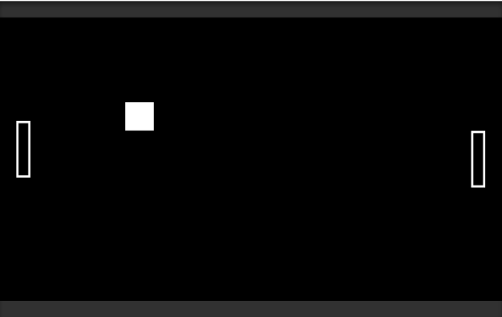

These were not super complicated add ons but they helped me understand better how to manipulate a script using velocity, arrays, sprites etc. I also got to see how even the smallest changes can affect a game's feel.

It also helped me see how I could improve my Exploration Prototype 2 if I wanted to.

Next steps:

to make the game even more interesting, in the future I could:
- add color changes (the ball could change colors, the walls could change colors...)
- make it so the speed of the ball after it hits a paddle is random (could get faster, slower etc) to add even more unknown factors
- add 2 paddles, make it a 4-player game


# Exploration Prototype 1 - 29.01.26

Idea:

Since we explored in class the Unity components movement, colliders and instantiation, I wanted to create a prototype to play with those functionalities and see what code I could use that was in the textbook or in the GottaCatchaMall or in the Unity Essentials projects.

I wanted to try to create a prototype where the player controls a cube and every time that cube touches a wall that wall randomly changes colors.

First I started by creating the walls of the room and giving them all a boxcollider so that the player could enter in contact with them.

I then created the 2d object square that was going to be my player. I added a BoxCollider2d as well as a Rigidbody2d with a gravity of 0 since I don’t want it to fall and I want to move it in the box freely, in all directions.


I took inspiration from the script for GottaCatchaMall to create the script for my player box. It took me a few tries to understand how to make my player move depending on the arrow input.
Since in GottaCatchaMall the basket only moves from left to right and I wanted my box to move left right up and down, I had to create a variable box_x and box_y.

My script at first wasn’t working, so I had to go and manually set the input manager to old like we had to do in class.


Ok so at this point I was also lost because my square was walking though the walls even though they all had a box collider. And then I realized I forgot to add a RigidBody2d to my walls. I met that change and set their body type as static. But I was still encountering the same issue. So I manually changed the limits of the movement from the GottaCatchaMall script to make it look like my square couldn’t leave the box, even if it was manually and not through RigidBody collision.

Then I realized I didn’t know how to execute my idea that if the box touches a wall that wall changes color given the fact that I was having trouble accessing my player’s Rigidbody. 

So I decided to follow along the 2d Essentials video tutorials from Unity Essentials to see if I could experiment with it and find an answer to my problem.

In the Pathway Unity Essentials, I looked at the programming essentials mission and took a look at the script from their example. In the mission the goal is to control a robot vacuum that can move and rotate in a room. 
In the robot vacuum tutorial they had
private Rigidbody rb; // Reference to player's Rigidbody.
And 
rb = GetComponent<Rigidbody>(); // Access player's Rigidbody.
to access the object’s Rigidbody which seemed like a good start to fix my problem.

But I decided to turn my focus to using the rest of the tutorial to implement a collectible in my prototype. I created a script and wanted to add it to my collectible object but then I kept getting a “Can't add script” error message that I couldn’t fix.

So, once again, I decided to pivot and change direction. I couldn’t figure out how to implement rigidbody, I didn’t know how I was going to go about changing the color of walls on impact and I didn’t understand why my new script wouldn’t attach itself to a new object. I wanted to end on a victory :) so I simply wanted to add a random cube falling.

I looked at the script from GottaCatchaMall BuildingDropperScript and took inspiration from it.
I used this line of code:

GameObject currentBuilding = Instantiate(building, buildingPos, transform.rotation);

Renaming it, and using a if (Input.GetKeyDown(randomKey)); function, I managde to make it so that when I press the spacebar, an object falls.

I assigned this object a Rigidbody and box collider and funny enough, it does get blocked by the walls and can be moved by the player square. I’m sure the answer to why my player square can move past the walls is right in front of me.

So now I have a prototype where the player controls a square, and that square can push around a small yellow ball within a rectangular room.

Definitely a lot of trial with errors, I’m still confused on how the rigidbody works.

Next steps:
- fixing the rigidbody issue on the walls
- making more balls fall down
- making the walls change colors when they are interacted with, maybe do the same with the balls?


# Make-a-Thing, design reflection 22.01

I got the character sprite from itch.io, creator is Arkno:
https://project-arkno.itch.io/kayas-character-sprite


It was my first time using GB Studio. When I started looking at it, I realized the most time consuming part of making a game was going to be creating the scenes and the art for the background. 
Therefore I chose to make a labyrinth game where the player can only move from left to right.


Since I wanted the player to only move from left to right, I made a labyrinth of identical rooms made of one narrow hallway. 


To make sure the player was only going to be able to walk in a straight line, I added collisions and made sure that in the play view it looked like the character was walking on the “floor”, not flying or walking below it (it took a few tries).


My game goes as:

You walk to the right end of the room, get asked a question on which room you want to go to next. You first choose between rooms Star and Oval, then between Round and Field, then between Cats and Dogs. If you go through the right ones (example: Star then Field then Dogs), you win. If not, you lose and can restart. You need to remember which rooms you chose.


To keep track of whether the player chose the right room I had to create a Math function inside of some of my loops.
I created the global variable Victory_Path, and if the right room was picked, before getting teleported to it, +1 was added to Victory_Path.


Therefore, the trigger in the last room checks the value of Victory_Path to know which room to teleport the player to (Victory or Game Over)


If the player wants to start from the top, Victory_Path is set to 0.


Comments on things that didn’t work::

At first I wanted each room (7 of them) to look different, that's why I created 7 different scenes. But since I didn’t end up having the time to change the way they looked, I could have only had one room and changed the dialogue that asks which room to go to and still keep track of the global variable.
Instead I lost efficiency by creating all these different scenes.

When it comes to the triggers at the left and right of the room, I couldn't find a way to make it so the movement stops when the player is on the trigger and it doesn’t look like the player is walking into the wall.

Also I didn’t know how to change the key that had to be pressed to select so it is still Z, which i wanted to change.
